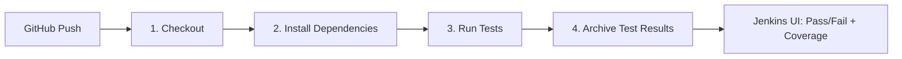

# Calculator — Jenkins CI/CD Demo

A university **DevOps / CI/CD** demonstration project. The Python app is intentionally minimal — a four-function calculator — so the presentation stays focused on **Jenkins** (80%), not Python (20%).

> Push code → Jenkins runs the pipeline → test results and coverage appear in the UI. That's the demo.

---

## Table of Contents

- [Why So Simple?](#why-so-simple)
- [Project Structure](#project-structure)
- [CI/CD Workflow](#cicd-workflow)
- [Prerequisites](#prerequisites)
- [Local Setup](#local-setup)
- [Running Tests Locally](#running-tests-locally)
- [Jenkins Setup](#jenkins-setup)
- [Demo Script (15 Minutes)](#demo-script-15-minutes)
- [Break Test Demo (Fail → Fix → Pass)](#break-test-demo-fail--fix--pass)
- [Screenshots](#screenshots)
- [License](#license)

---

## Why So Simple?

| Focus | What the audience sees |
|-------|------------------------|
| **80% Jenkins** | Pipeline stages, GitHub webhook, test results, coverage report, build failure/success |
| **20% Python** | `add`, `subtract`, `multiply`, `divide` — understood in 10 seconds |

The calculator exists only to give Jenkins something to test. The real deliverable is the **CI pipeline**.

---

## Project Structure

```
jenkins-ci-demo/
├── Jenkinsfile              # Declarative pipeline (4 stages)
├── README.md
├── requirements.txt           # pytest, pytest-cov
├── pytest.ini                 # JUnit XML + coverage config
├── src/
│   └── calculator.py          # 4 math functions
└── tests/
    └── test_calculator.py     # 8 unit tests
```

### The App (10-second explanation)

```python
add(2, 3)        # → 5
subtract(10, 4)  # → 6
multiply(3, 4)   # → 12
divide(10, 2)    # → 5
divide(10, 0)    # → ValueError
```

---

## CI/CD Workflow



| Stage | What happens | Output |
|-------|--------------|--------|
| **Checkout** | Clone repo from GitHub | Source on Jenkins agent |
| **Install Dependencies** | `python -m venv` + `pip install -r requirements.txt` | Isolated environment |
| **Run Tests** | `pytest` with coverage | JUnit XML + HTML coverage |
| **Archive Test Results** | Publish reports to Jenkins UI | Test trend graph + downloadable artifacts |

### Reports Jenkins displays

- **Test Result** — pass/fail counts from `junit-report.xml`
- **Coverage Report** — HTML report (Publish HTML plugin)
- **Build Artifacts** — full `test-results/` folder

---

## Prerequisites

**Local:** Python 3.10+, pip

**Jenkins:**
- Jenkins 2.x with **Git**, **JUnit**, and **HTML Publisher** plugins
- Agent with Python 3.10+
- GitHub repo + webhook (optional, for live push demo)

---

## Local Setup

```bash
git clone <your-repo-url>
cd jenkins-ci-demo

python -m venv .venv

# Windows
.venv\Scripts\activate

# Linux / macOS
source .venv/bin/activate

pip install -r requirements.txt
```

---

## Running Tests Locally

```bash
pytest
```

Expected output: **8 passed**, coverage report in terminal.

Reports written to `test-results/`:

| File | Purpose |
|------|---------|
| `test-results/junit-report.xml` | Jenkins test results |
| `test-results/coverage.xml` | Cobertura XML |
| `test-results/coverage-html/` | Browsable HTML coverage |

---

## Jenkins Setup

### 1. Push to GitHub

```bash
git init
git add .
git commit -m "Initial commit: calculator CI demo"
git remote add origin <your-repo-url>
git push -u origin main
```

### 2. Create Pipeline Job

1. Jenkins → **New Item** → name it → **Pipeline** → OK
2. **Pipeline** section:
   - Definition: **Pipeline script from SCM**
   - SCM: **Git**
   - Repository URL: your GitHub URL
   - Branch: `main`
   - Script Path: `Jenkinsfile`
3. Save

### 3. Add GitHub Webhook (for live demo)

1. GitHub repo → **Settings** → **Webhooks** → **Add webhook**
2. Payload URL: `http://<jenkins-url>/github-webhook/`
3. Content type: `application/json`
4. Events: **Just the push event**

Now every `git push` triggers a Jenkins build automatically.

### 4. First Build

Click **Build Now** (or push a commit). After completion:

- **Test Result** → 8 tests passed
- **Coverage Report** → 100% coverage
- **Build Artifacts** → download reports

---

## Demo Script (15 Minutes)

| Time | Activity | Talking Points |
|------|----------|----------------|
| 0–1 min | Show `calculator.py` | "Four functions — that's the whole app" |
| 1–3 min | Walk through `Jenkinsfile` | Four stages, JUnit XML, artifact archiving |
| 3–5 min | Show GitHub webhook config | "Every push triggers a build automatically" |
| 5–8 min | **Live push** → watch Jenkins build | Checkout → Install → Test → Archive |
| 8–11 min | Open **Test Result** + **Coverage Report** | Automated feedback on every commit |
| 11–15 min | **Break test demo** (see below) | Show failure detection + recovery |

---

## Break Test Demo (Fail → Fix → Pass)

This is the most impactful part of the presentation — show Jenkins catching a broken build, then passing after a fix.

### Step 1 — Break a test

Open `tests/test_calculator.py` and change one assertion:

```python
def test_add() -> None:
    """add() should return the sum of two numbers."""
    assert add(2, 3) == 99   # ← intentionally wrong (was 5)
    assert add(-1, 1) == 0
```

### Step 2 — Push and watch Jenkins fail

```bash
git add tests/test_calculator.py
git commit -m "demo: intentionally break add test"
git push
```

In Jenkins:
- Build turns **red**
- **Test Result** shows: `1 failed, 7 passed`
- Console log shows: `AssertionError: assert 5 == 99`

### Step 3 — Fix the test and push again

```python
def test_add() -> None:
    """add() should return the sum of two numbers."""
    assert add(2, 3) == 5    # ← fixed
    assert add(-1, 1) == 0
```

```bash
git add tests/test_calculator.py
git commit -m "fix: restore correct add assertion"
git push
```

In Jenkins:
- Build turns **green**
- **Test Result** shows: `8 passed`
- Test Result trend graph shows the failure spike then recovery

### What this demonstrates

| Concept | What the audience sees |
|---------|------------------------|
| **Continuous Integration** | Every push is automatically tested |
| **Fast feedback** | Failure detected within seconds of push |
| **Test reports in CI** | Exact failing test shown in Jenkins UI |
| **Recovery workflow** | Fix → push → green build |

---

## Screenshots

> Replace placeholders after your first Jenkins build.

### Pipeline — All Stages Green

<!--  -->
*Screenshot: four stages with green checkmarks.*

### Test Results — 8 Passed

<!--  -->
*Screenshot: Jenkins Test Result page.*

### Break Test — Red Build

<!--  -->
*Screenshot: red build showing 1 failed test after intentional break.*

### Coverage Report

<!--  -->
*Screenshot: HTML coverage report at 100%.*

---

## License

Provided for **educational purposes** as part of a university DevOps / CI/CD coursework demonstration.
